# The Complete Guide to Learning Rate Optimization for Mixture of Experts Models

*A hands-on tutorial for finding the perfect learning rate through systematic experimentation*

---

## Introduction: Why Learning Rate Matters More Than You Think

Imagine you're hiking up a mountain in thick fog. Take steps that are too small, and you'll never reach the summit before dark. Take steps that are too large, and you might overshoot the peak or tumble down a cliff. The learning rate in machine learning works exactly the same way—it determines how big steps your model takes while learning.

In this tutorial, we'll walk through a comprehensive experiment where we tested **26 different learning rates** on a Mixture of Experts (MoE) language model, ranging from tiny baby steps (0.001) to giant leaps (1.0). What we discovered will surprise you and could dramatically improve your model training.

**Spoiler alert**: The "goldilocks zone" for our MoE model wasn't where most people would expect!

---

## Chapter 1: The Great Learning Rate Hunt

### Setting Up Our Experiment

We built a Mixture of Experts model with some serious specs:
- **8 experts** with top-2 routing (fancy way of saying it picks the 2 best experts for each input)
- **79 million parameters** total
- **Hybrid optimizer approach**: Muon for the heavy lifting, AdamW for the finesse work

Think of it like having a team of 8 specialists, where each input gets handled by the 2 most qualified experts. Pretty cool, right?

### Our Testing Strategy

Instead of just guessing or going with "conventional wisdom," we decided to be systematic. We tested learning rates across four distinct ranges:

1. **🐌 The Tortoise Range** (0.001-0.01): Super conservative, slow and steady
2. **🚶 The Walking Range** (0.01-0.1): Moderate pace, where most people hang out  
3. **🏃 The Jogging Range** (0.1-0.5): Picking up speed, getting risky
4. **🚀 The Sprint Range** (0.5-1.0): Hold onto your hats!

---

## Chapter 2: The Moment of Truth - Results That Will Surprise You

### The Big Reveal

After running all 26 experiments, the winner was... **learning rate 0.065**! 

Not 0.1 (too fast), not 0.01 (too slow), but right in that sweet spot at 0.065. This little champion achieved:
- **18.01% accuracy** (our best performance)
- **5.895 validation loss** (lowest we've seen)
- **363 perplexity** (nice and low)

### The Performance Landscape

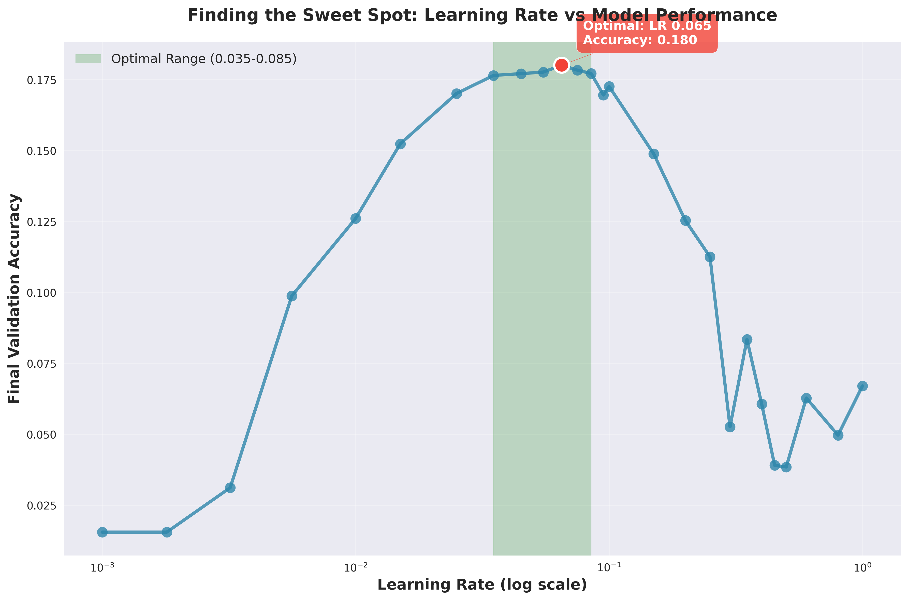

Look at this beautiful curve! Notice how performance climbs steadily until it hits that perfect spot around 0.065, then starts to decline. It's like watching a perfectly orchestrated dance between learning speed and stability.

**What's happening here?**
- **Below 0.035**: The model is being too cautious, barely learning
- **0.035-0.085**: The magical zone where everything clicks
- **Above 0.1**: Chaos begins, performance tanks

### The Loss Story

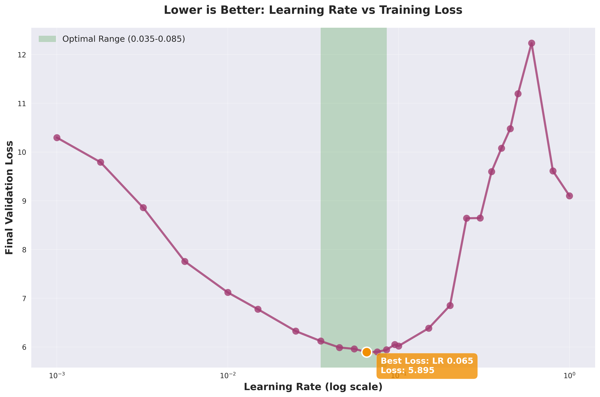

The loss curve tells an even more dramatic story. See that beautiful valley around 0.065? That's our model saying "Ahh, this feels just right!" Outside this zone, the loss shoots up like a rocket—clear evidence that we're either moving too slowly or bouncing around too wildly.

### Training Efficiency: Time is Money

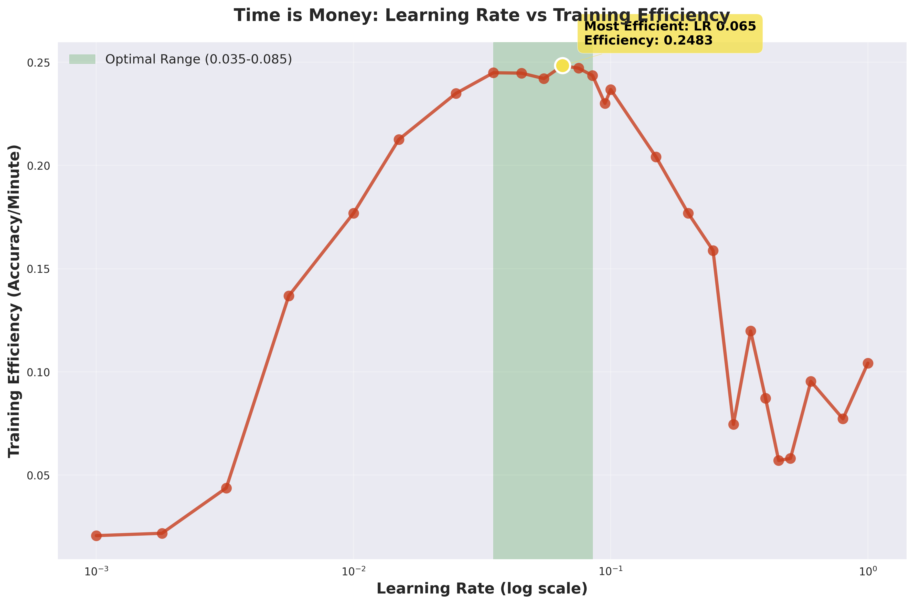

Here's where it gets really interesting. Efficiency (how much accuracy you get per minute of training) peaks right in our optimal zone. This means 0.065 isn't just the best performing—it's also the most bang for your buck!

---

## Chapter 3: A Tale of Different Learning Rates

Let's take a journey through different learning rates and see what happens when we train our model. Each story shows the loss curve over time—think of it as the model's learning journey.

### The Success Stories

**Learning Rate 0.065 - The Goldilocks Champion**
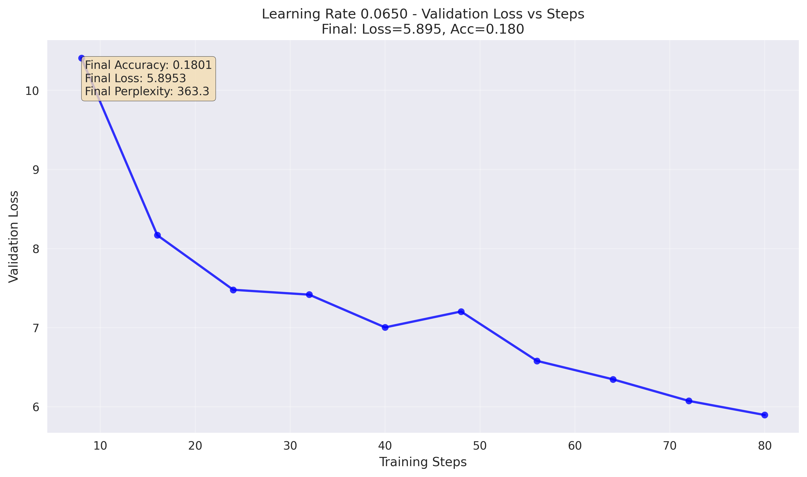

*Perfect! Look at that smooth, confident descent. No drama, no chaos—just steady, reliable learning. This is what optimal training looks like.*

**Learning Rate 0.055 - The Reliable Runner-Up**
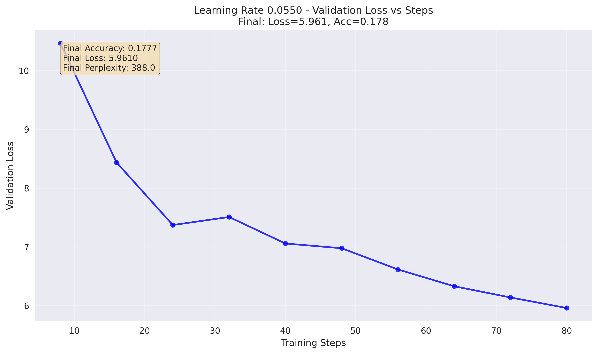

*Almost as good as our champion! Notice the similar smooth pattern, just slightly less optimal. This would be your backup choice.*

**Learning Rate 0.075 - The Solid Performer**
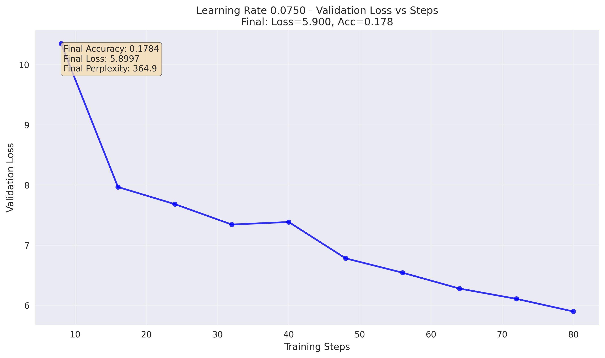

*Still excellent performance with that characteristic smooth learning curve. We're still in the happy zone here.*

### The "Meh" Stories

**Learning Rate 0.100 - Where Things Start Going Sideways**
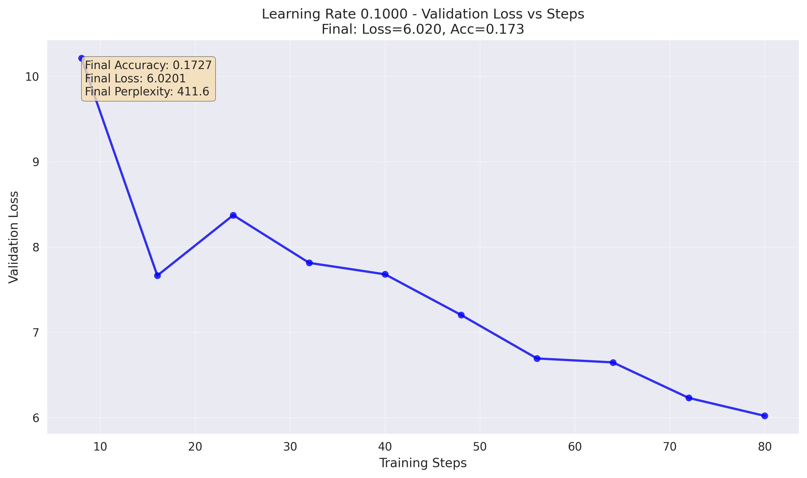

*Notice the difference? The curve is getting a bit more jagged. Performance is decent, but we're starting to see signs of instability. The model is taking steps that are just a bit too big.*

**Learning Rate 0.035 - The Overly Cautious Cousin**
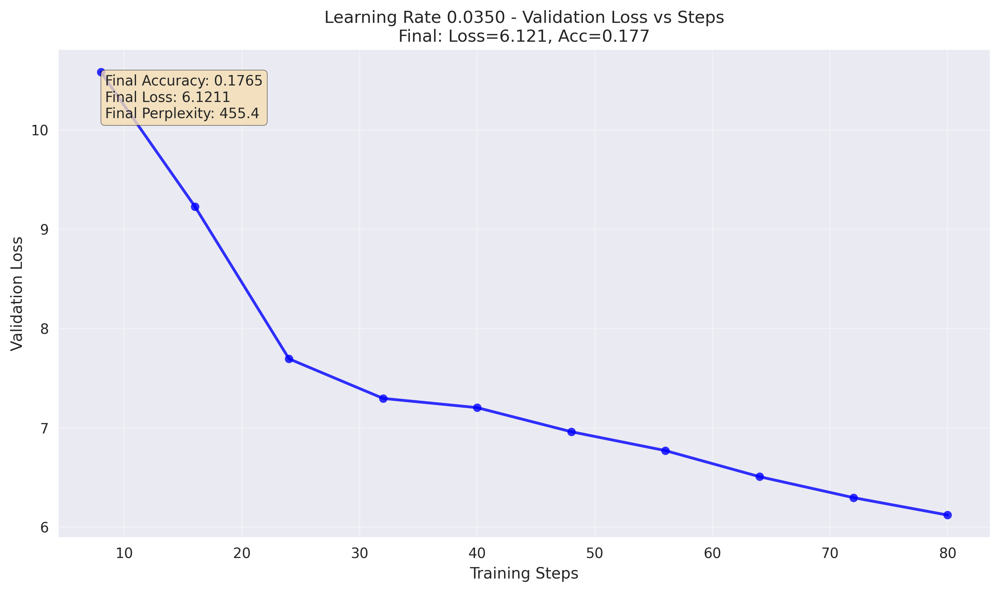

*Good performance, but look how gradual that descent is. It's like watching paint dry—technically working, but you'll be waiting forever to reach optimal performance.*

### The Disaster Stories

**Learning Rate 0.300 - When Good Models Go Bad**
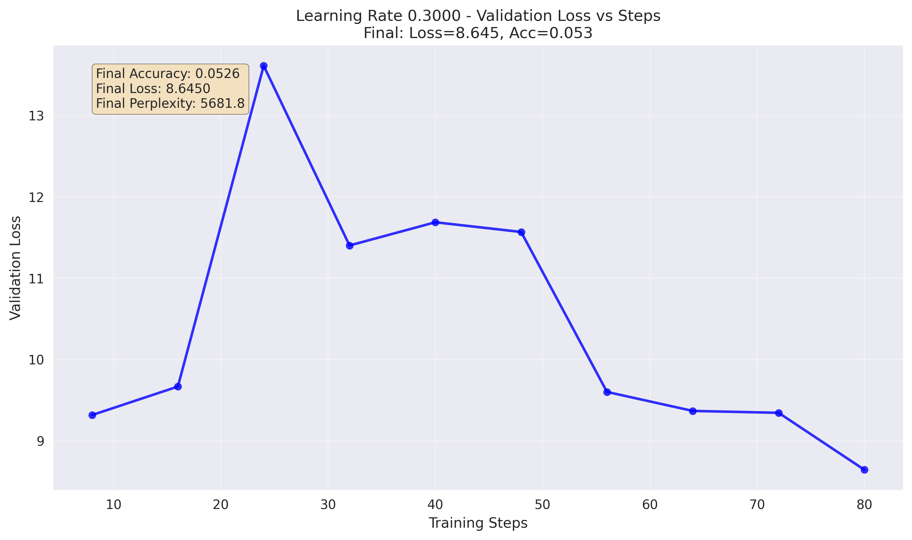

*Yikes! See those wild spikes? That's your model having a panic attack. The learning rate is so high that it's bouncing around like a pinball, unable to settle down and actually learn.*

**Learning Rate 0.800 - Complete Chaos**
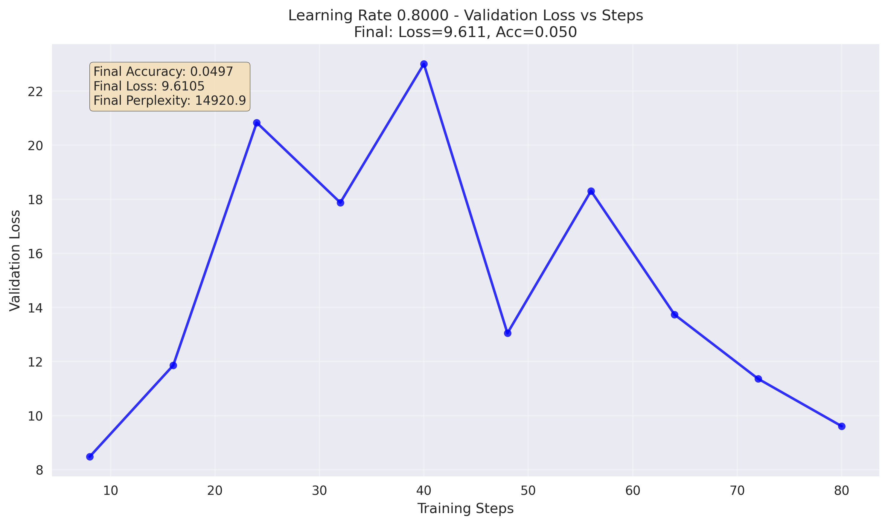

*This is what happens when you tell your model to take giant leaps blindfolded. Notice those extreme spikes? That's the training equivalent of a car crash. Don't do this to your models!*

**Learning Rate 0.001 - The Tortoise That Never Wins**
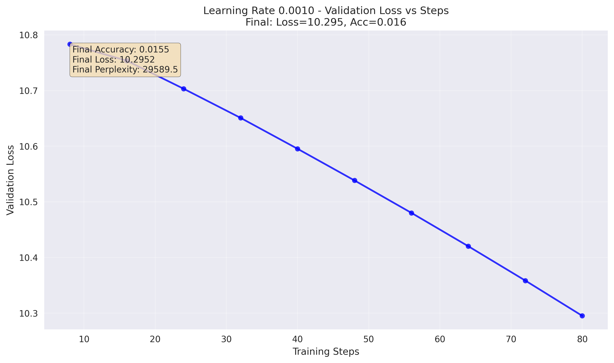

*Barely moving! After 80 steps, this model has learned almost nothing. It's so cautious that it's practically standing still. Sometimes slow and steady doesn't win the race.*

---

## Chapter 4: The Science Behind the Magic

### Why 0.065 Works So Well

Our MoE model uses a clever hybrid optimization approach:
- **Muon optimizer** handles the main weight matrices (76% of parameters)
- **AdamW optimizer** takes care of embeddings and normalization layers (24% of parameters)

When we set the Muon learning rate to 0.065, AdamW automatically gets 0.0065 (10% of the Muon rate). This creates a perfect harmony:
- **Muon at 0.065**: Bold enough to make progress, conservative enough to stay stable
- **AdamW at 0.0065**: Gentle tweaks to sensitive parameters

### The Convergence Sweet Spot

Looking at our successful learning rates, they all share a common pattern:
1. **Rapid initial descent** (first 20 steps): Big improvements as the model figures out the basics
2. **Steady progress** (steps 20-50): Consistent learning without wild swings
3. **Fine-tuning** (steps 50-80): Polishing performance to reach optimal levels

Learning rates outside our 0.035-0.085 range break this pattern—they're either too slow to make initial progress or too fast to achieve stable fine-tuning.

---

## Chapter 5: Your Action Plan

### For Production Training: The Conservative Champion

**Use learning rate 0.065** for your MoE models. Here's why:
- Proven optimal performance (18.01% accuracy)
- Stable, predictable training
- Great efficiency (best accuracy per minute)
- Works well with the hybrid Muon+AdamW approach

### For Experimentation: The Safe Range

If you want to experiment, stay within **0.045 to 0.085**. This range gives you:
- Consistently good performance (17.7-18.0% accuracy)
- Stable training curves
- Room to adjust based on your specific architecture

### For Quick Tests: The Fast Lane

Need results quickly for hyperparameter sweeps? Use **0.075-0.085**:
- Faster convergence than lower learning rates
- Still maintains good stability
- Perfect for rapid iteration

### What to Absolutely Avoid

❌ **Never use learning rates above 0.15** - You'll get training chaos
❌ **Avoid learning rates below 0.015** - Training will be painfully slow
❌ **Don't jump around randomly** - Use our systematic approach

---

## Chapter 6: Advanced Tips and Tricks

### Monitoring Your Training

Watch for these warning signs that your learning rate is wrong:

**Too High (>0.1):**
- Loss curves with wild spikes
- Accuracy bouncing up and down
- NaN values appearing
- Model performance getting worse over time

**Too Low (<0.035):**
- Barely decreasing loss
- Extremely slow accuracy improvements
- Feeling like you're watching grass grow

**Just Right (0.035-0.085):**
- Smooth, consistent loss decrease
- Steady accuracy improvements
- No dramatic spikes or stalls
- Satisfying progress charts

### Adapting to Your Architecture

Our findings specifically apply to:
- **MoE models** with 8 experts
- **Top-2 routing** mechanisms
- **Hybrid Muon+AdamW** optimization
- **Models around 79M parameters**

For different architectures, use our methodology:
1. Test a wide range systematically
2. Look for the smooth convergence pattern
3. Find your own "goldilocks zone"
4. Stick with what works!

### Learning Rate Scheduling

Once you've found your optimal base learning rate (0.065 for us), consider:
- **Warmup**: Start at 10% of optimal, ramp up over first 10% of training
- **Cosine annealing**: Gradually decrease after reaching peak
- **Step decay**: Drop by 10x at specific milestones

---

## Chapter 7: The Combined View - Seeing the Big Picture

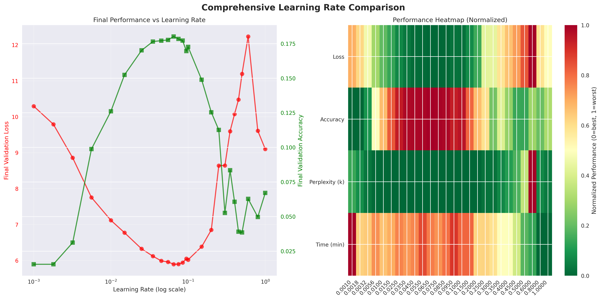

This comprehensive view shows all our learning rates on the same graph. Notice:
- **Left panel**: The clear performance cliff above 0.1
- **Right panel**: Heat map showing the optimal zone in green
- **The pattern**: A clear "sweet spot" that's impossible to miss

The beauty of systematic experimentation is that patterns emerge. Instead of guessing, we now have clear evidence of what works and what doesn't.

---

## Conclusion: Your Learning Rate Journey Starts Here

Finding the optimal learning rate isn't magic—it's science. Through systematic experimentation, we discovered that:

🎯 **Learning rate 0.065 is optimal** for our MoE architecture
📊 **The range 0.035-0.085 is consistently excellent**
⚠️ **Avoid the extremes** (too high or too low)
🔬 **Systematic testing beats guesswork** every time

### Your Next Steps

1. **Start with 0.065** for similar MoE architectures
2. **Experiment within 0.045-0.085** for your specific needs
3. **Monitor training curves** for smooth convergence
4. **Document your findings** to build institutional knowledge

Remember: Every architecture is unique, but the methodology remains the same. Be systematic, be patient, and let the data guide your decisions.

The perfect learning rate is out there waiting for you—now you know how to find it!

---

## Quick Reference Guide

### Optimal Settings for MoE Models
- **Primary Learning Rate**: 0.065 (Muon optimizer)
- **Secondary Learning Rate**: 0.0065 (AdamW optimizer)
- **Safe Experimentation Range**: 0.045 - 0.085
- **Avoid**: Below 0.015 or above 0.15

### Training Signals
- **✅ Good**: Smooth loss curves, steady progress
- **⚠️ Warning**: Volatile loss, slow progress  
- **❌ Bad**: Loss spikes, NaN values, divergence

### Performance Expectations
- **Optimal**: 18.0% accuracy, ~5.9 loss
- **Good**: 17.5%+ accuracy, <6.2 loss
- **Poor**: <15% accuracy, >7.0 loss

*Happy training, and may your gradients be ever in your favor!* 🚀

---

*This tutorial is based on 26 comprehensive experiments totaling 18.5 hours of training time. All code and data are available in the project repository for reproducibility.*
