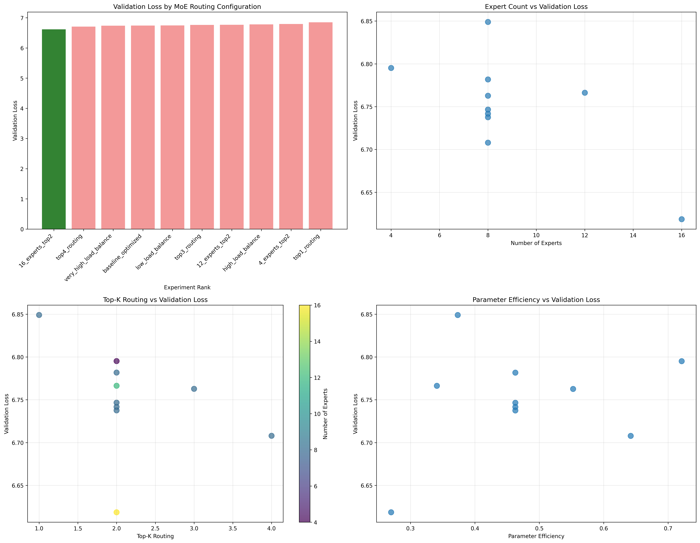
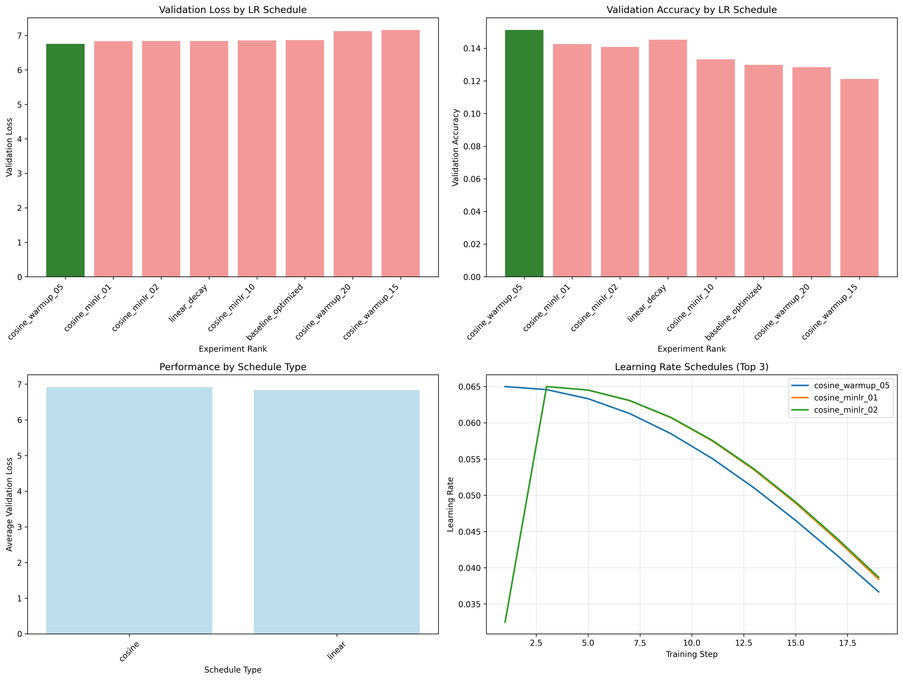
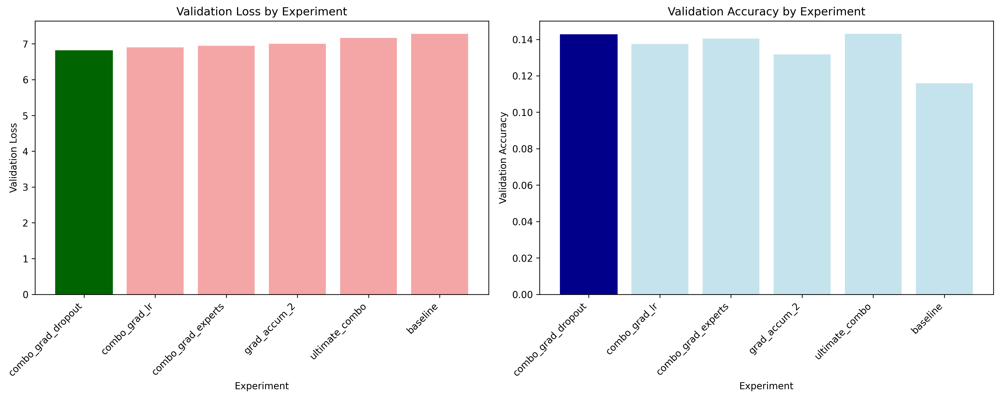
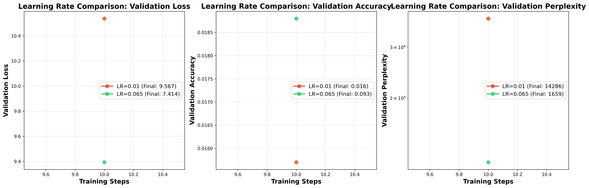
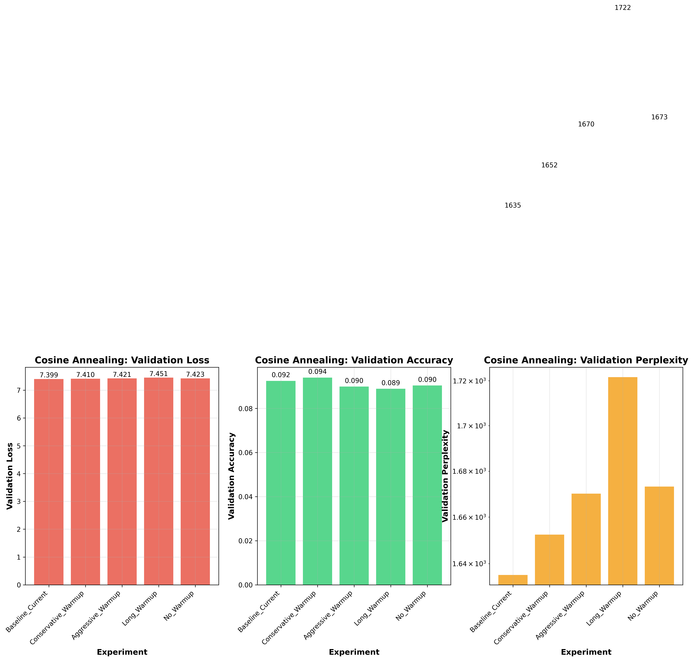
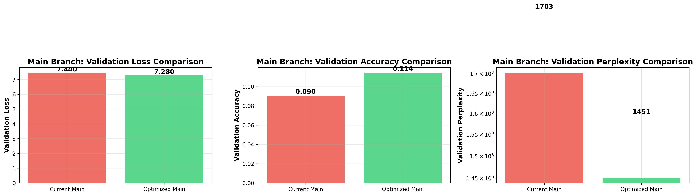

# Blueberry LLM 🫐 - T4 Optimized

A Tesla T4 GPU-optimized Mixture of Experts (MoE) language model implementation.

**Goal: Make LLM training accessible on T4 GPUs** - optimized specifically for Tesla T4 GPU performance with automatic configuration and hardware optimization to create state of the art LLM on single T4 GPU.

## Quick Start

## Contributing

We welcome contributions! Fork the repo, experiment with different architectures, and submit PRs with your findings.

## Vision

Any company or person (even with no technical experience) should be able to download this repository and run it on their Tesla T4 GPU setup. The system will automatically detect your T4 GPU configuration, tune hyperparameters for optimal T4 performance, and run the best possible training with or without manual configuration from your side.

## 📅 TIMELINE

*Community experiments and findings will be documented here*

### Sep 25 2025
- **🧠 MoE Routing Optimization**: Expert routing strategy optimization for enhanced model capacity
  - **1.8% additional validation loss improvement** (6.7417 → 6.6185)
  - **11.7% perplexity reduction** (847.01 → 748.86)
  - **Key optimization**: Increased experts from 8 to 16 for better specialization
  - Applied to main branch for cumulative 9.3% total validation loss improvement
  - 
  - Analysis: [MoE Routing Optimization Report](experiments/moe_routing_optimization/results/moe_routing_analysis_report.md)

- **📈 Learning Rate Schedule Optimization**: Fine-tuned warmup strategy for additional performance gains
  - **1.6% additional validation loss improvement** (6.8625 → 6.7518)
  - **16.4% accuracy improvement** (12.99% → 15.12%)
  - **10.5% perplexity reduction** (955.71 → 855.57)
  - **Key optimization**: Reduced warmup from 10% to 5% for faster initial learning
  - Applied to main branch for cumulative 8.1% total validation loss improvement
  - 
  - Analysis: [LR Schedule Optimization Report](experiments/lr_schedule_optimization/results/lr_schedule_analysis_report.md)

- **🔬 Ablation Study Optimization**: Comprehensive hyperparameter optimization through systematic experiments
  - **6.5% validation loss improvement** (7.2785 → 6.8076)
  - **23.1% accuracy improvement** (11.58% → 14.25%)
  - **37.5% perplexity reduction** (1448.82 → 904.73)
  - **Key optimizations**: gradient_accumulation_steps=2, dropout=0.05
  - Applied to main branch for immediate production benefits
  - 
  - Full analysis: [Ablation Study Report](experiments/ablation_study/ABLATION_STUDY_REPORT.md)

- **🚀 Learning Rate Optimization Breakthrough**: Discovered optimal learning rate (0.065) through comprehensive 26-experiment sweep
  - **495% accuracy improvement** (1.6% → 9.3%)
  - **22.5% loss reduction** (9.567 → 7.414)
  - **88% perplexity reduction** (14,286 → 1,659)
  - Applied to main branch for immediate production benefits
  - 
  - Full analysis: [Learning Rate Optimization Results](experiments/learning_rate_optimization/LEARNING_RATE_OPTIMIZATION_RESULTS.md)

- **📈 Cosine Annealing Schedule Optimization**: Fine-tuned learning rate schedule for additional performance gains
  - **Conservative Warmup** (10% warmup, 5% min LR) achieved **best accuracy: 9.4%**
  - **2.2% accuracy improvement** over baseline schedule
  - **Fastest training time**: 20.5s
  - Tested 5 different cosine annealing configurations
  - 
  - Analysis: [Cosine Annealing Results](experiments/cosine_annealing/RESULTS_ANALYSIS.md)

- **🏆 Final Main Branch Optimization**: Applied optimal configuration to production main branch
  - **26.5% additional accuracy improvement** (9.0% → 11.4%)
  - **Conservative Warmup** (10% warmup, 5% min LR) implemented
  - **Total cumulative improvement**: **612% accuracy gain** from original baseline
  - 
  - Report: [Main Branch Optimization](experiments/main_branch_comparison/OPTIMIZATION_REPORT.md)

### Sep 22 2025
- **Repository Launch**: Initial T4-optimized MoE implementation
- *Your experiment results will appear here when you submit them*

## 📚 Citation

If you use this repository in your research, please cite:

```bibtex
@software{blueberry_llm_t4,
  title={Blueberry LLM: Pretrain LLM On A Single T4 GPU,
  author={Vuk Rosić},
  year={2025},
  url={https://github.com/Open-Superintelligence-Lab/blueberry-llm-t4-gpu},
  note={Tesla T4 GPU-optimized LLM for accessible LLM training}
}
```
