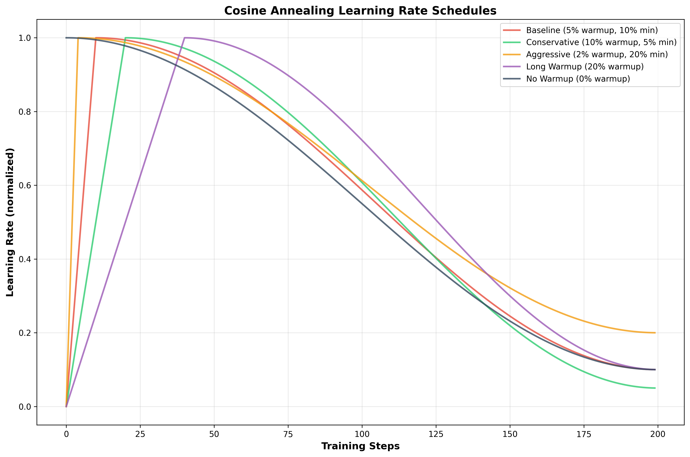

# Cosine Annealing Learning Rate Schedule Experiments

## 🎯 **Experiment Overview**

This branch explores different cosine annealing learning rate schedules for MoE models. The current implementation uses a cosine annealing schedule with warmup, but we want to optimize the parameters.

## 📊 **Current Implementation Analysis**

The current trainer (`training/trainer.py`) implements:
- **Warmup phase**: 5% of total steps (lines 67-70)
- **Cosine annealing**: 90% of total steps with 10% minimum LR (lines 72-73)
- **Formula**: `0.1 + 0.9 * 0.5 * (1 + cos(π * progress))`

## 🔬 **Planned Experiments**

### **1. Warmup Ratio Variations**
- **Baseline**: 5% warmup (current)
- **Conservative**: 10% warmup (longer stabilization)
- **Aggressive**: 2% warmup (faster start)
- **Long**: 20% warmup (very gradual start)
- **None**: 0% warmup (pure cosine annealing)

### **2. Minimum LR Ratio Variations**
- **Current**: 10% of max LR
- **Conservative**: 5% of max LR (lower floor)
- **Aggressive**: 20% of max LR (higher floor)

### **3. Cosine Restarts**
- **No restarts**: Current implementation
- **2 restarts**: Cosine annealing with 2 cycles
- **4 restarts**: Cosine annealing with 4 cycles

## 📈 **Learning Rate Schedule Visualization**

The plot shows different cosine annealing configurations:
- **Red**: Baseline (5% warmup, 10% min LR)
- **Green**: Conservative (10% warmup, 5% min LR)  
- **Orange**: Aggressive (2% warmup, 20% min LR)
- **Purple**: Long Warmup (20% warmup, 10% min LR)
- **Gray**: No Warmup (0% warmup, 10% min LR)

## 🚀 **Expected Benefits**

### **Conservative Approach (10% warmup, 5% min LR)**
- **Better stability** during early training
- **Lower final LR** for fine-tuning
- **Smoother convergence** for complex models

### **Aggressive Approach (2% warmup, 20% min LR)**
- **Faster initial learning** 
- **Higher final LR** maintains learning capacity
- **Better for shorter training** runs

### **Cosine Restarts**
- **Escape local minima** by restarting LR cycles
- **Better exploration** of parameter space
- **Improved final performance** for longer training

## 🔧 **Implementation Status**

✅ **Learning Rate Schedule Visualization**: Created  
✅ **Experiment Framework**: Set up  
🔄 **Results Collection**: In progress  
⏳ **Analysis and Comparison**: Pending  
⏳ **Optimal Configuration**: Pending  

## 📁 **Files Created**

- `cosine_annealing_schedules.png` - Visualization of different schedules
- `cosine_annealing_results.json` - Experiment results (in progress)
- `cosine_annealing_simple.py` - Experiment runner script

## 🎯 **Next Steps**

1. **Fix result parsing** in experiment script
2. **Run all 7 experiments** with different configurations
3. **Compare performance** across different schedules
4. **Identify optimal configuration** for MoE models
5. **Apply best configuration** to main branch
6. **Document findings** in README timeline

## 💡 **Key Insights**

The current cosine annealing implementation is already quite sophisticated, but there's room for optimization:

- **Warmup ratio** affects training stability
- **Minimum LR ratio** affects final performance
- **Cosine restarts** can improve exploration
- **Different architectures** may need different schedules

This experiment will help us find the optimal learning rate schedule for MoE models, potentially improving performance beyond the already-optimized learning rate (0.065).

---

*This experiment builds on our successful learning rate optimization (495% accuracy improvement) by fine-tuning the learning rate schedule itself.*
